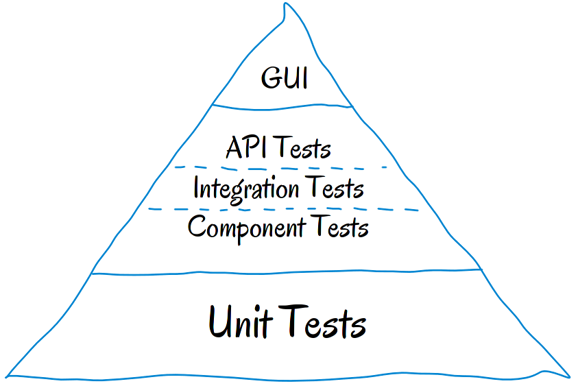
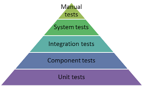
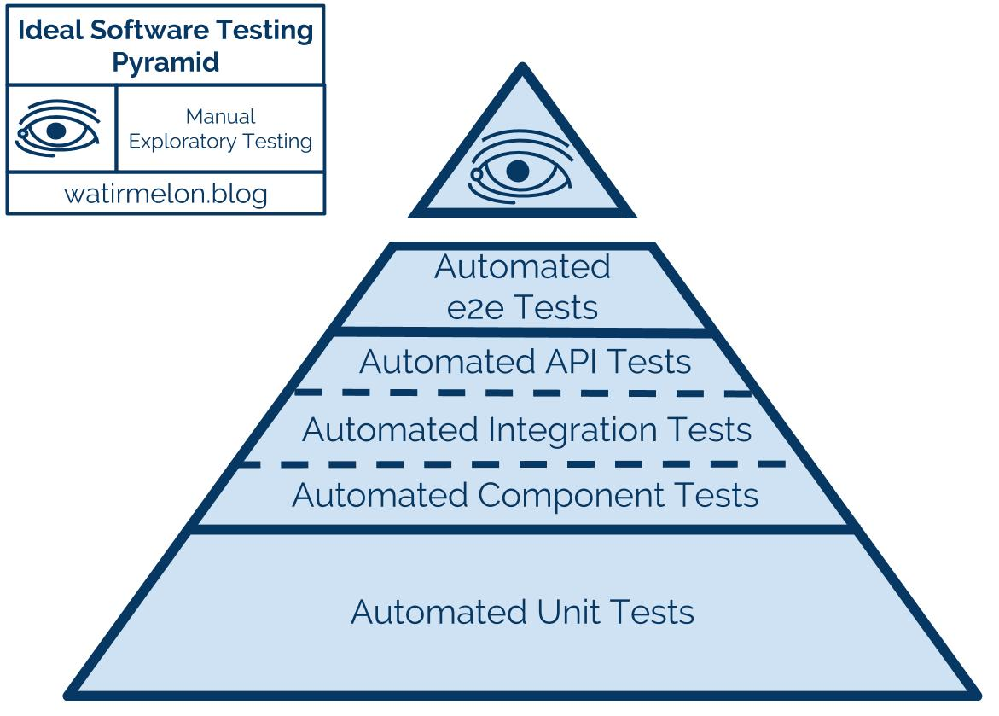

# The Test Pyramid

---

---

---

---

--- 

Write tests with different granularity
The more high-level you get the fewer tests you should have

Stick to the pyramid shape to come up with a healthy, fast and maintainable test suite: 
* _lots_ of small and fast unit tests
* _some_ more coarse-grained tests 
* _very few_ high-level tests that test your application from end to end.